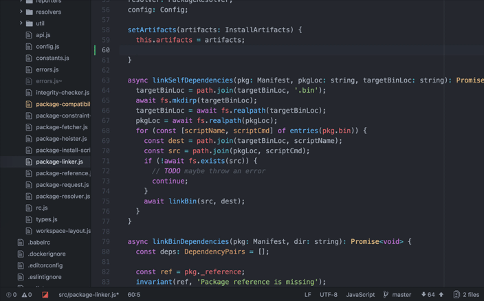
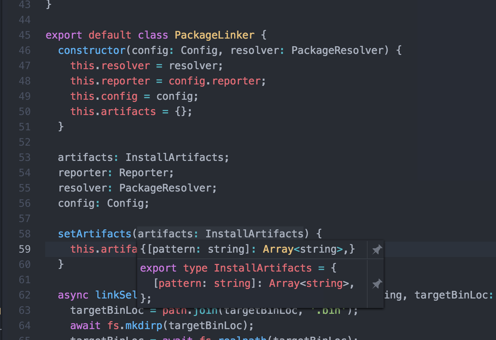
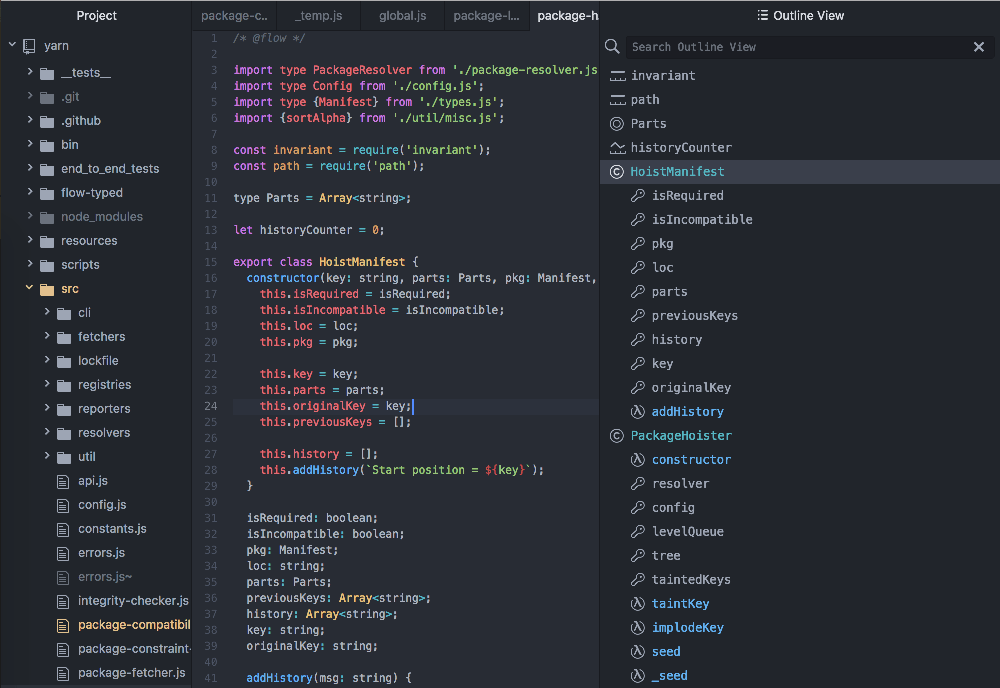

# Flow for Atom IDE (ide-flow)
[Flow-typed JavaScript](https://flow.org/) support for Atom IDE, powered by [the Flow Language Server](https://github.com/flowtype/flow-language-server).

Extracted from Nuclide, Flow for Atom IDE brings all of the features you need to be productive with Flow-typed JavaScript into Atom.

## Installation
**Notice** Currently, you must also have the `atom-ide-ui` package (the core of Atom IDE) installed in order to take advantage of `ide-flow`. We're working with the Atom team to streamline this process.

Find `ide-flow` in the Atom package installer by opening Atom's **Settings**, navigating to **Install**, and searching for `ide-flow`. Or maybe you're here inside Atom already.

If you have Atom's command line utilities, installation is also just a matter of:
`apm install atom-ide-ui && apm install flowtype/ide-flow`

## What is Atom IDE?
Atom IDE brings the core features you expect in a full-featured IDE into Atom, such as language-aware autocomplete, diagnostics,  go-to-definition, type hints, symbol outlines, and more.

Atom IDE is extracted from [Nuclide](https://nuclide.io/) and is brought to you in partnership by GitHub and Facebook.

Atom IDE is also a standard protocol within Atom, so you can replace hackable pieces of UI and language integration with your favorites.

## Flow for Atom IDE Features

### Flow Version Management
Flow for Atom understands the version of flow you have on your system, as well `flow-bin` in your `package.json` (enable this in settings).

Otherwise, versions of flow are automatically downloaded, updated, and run transparently. This means you can create a `.flowconfig` for your project and get to work right away.

### Autocomplete

Suggestions directly from the flow server are prioritized in autocomplete. Return types and complex type definitions shown right along suggestions.

### Diagnostics

See problems directly in your code the second you hit save. No need to run your code, and no need to flip to your terminal to run `flow`. Instead, Flow for Atom IDE underscores problems as you code. You can even process large sets of problems at once with the bottom diagnostics pane.

### Go to Definition
Want to know how some of your JavaScript works under the hood? Hover over a symbol and hold ⌘ (Mac) or ctrl (Windows and Linux). You'll get a preview of the definition right away, and getting there is only a click away.

### Type Hints
Hover over a symbol and get instant feedback for what you're looking at. Flow even shows you types it can infer without any effort on your part.

### Outline
Get a birds-eye view of your JavaScript with an outline of the document's symbols, and click to jump right where you need to be.

## Contributing

### [Code of Conduct](https://code.facebook.com/codeofconduct)
Facebook has adopted a Code of Conduct that we expect project participants to adhere to. Please read the full text so that you can understand what actions will and will not be tolerated.

### Contributor License Agreement ("CLA")
In order to accept your pull request, we need you to submit a CLA. You only need
to do this once to work on any of Facebook's open source projects.

Complete your CLA here: <https://code.facebook.com/cla>

## License
ide-flow is BSD licensed. We also provide an additional patent grant.
